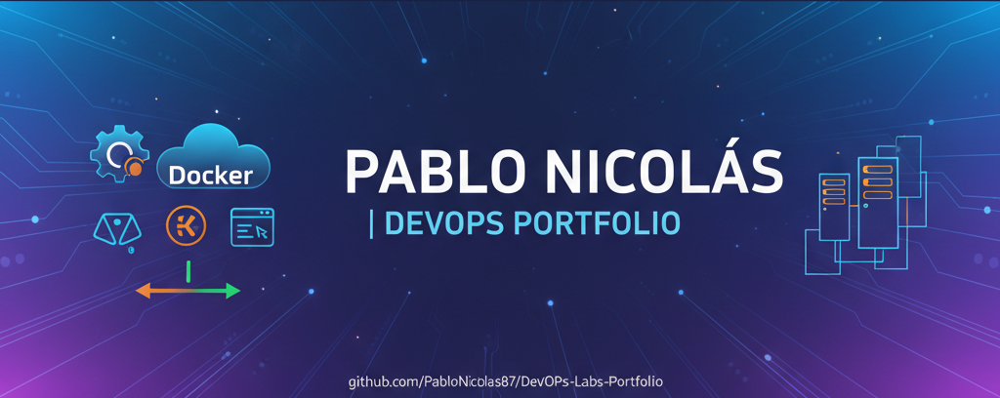

<!-- Banner -->
<p align="center">
  
</p>

# 🚀 DevOps Labs – Professional Learning Portfolio

> **Author:** [Pablo Nicolás Girone](https://github.com/PabloNicolas87)  
> **Focus:** DevOps • AWS • Docker • Terraform • GitHub Actions  
> **Region:** LATAM (Brazil / Argentina)  

This portfolio documents a practical learning journey through multiple **DevOps environments**, showing how a base application evolves across different deployment models — from containerized pipelines to serverless architectures.

Each lab builds upon the previous one, progressively adding new AWS services, automation layers, and DevOps best practices.

---

## 🧩 Tech Stack


---

## 🧱 LAB 1 – Containerized Base (CI/CD + EC2)
📦 **Repositories**
- App + CI/CD → [Devops-Lab1](https://github.com/PabloNicolas87/Devops-Lab1)
- Infrastructure (Terraform) → [Devops-Lab1-Terraform-IaC](https://github.com/PabloNicolas87/Devops-Lab1-Terraform-IaC)

**Goal:** Create a fully automated CI/CD pipeline that builds, publishes, and deploys a React application containerized with Docker into AWS EC2.

**Stack:** Docker • GitHub Actions • AWS EC2 • Elastic IP • Terraform

🔙 [Back to Top](#-devops-labs--professional-learning-portfolio)

---

## ⚙️ LAB 2 – Orchestration (ECS + Fargate + ALB)
📦 **Repositories**
- App + CI/CD → [Devops-Lab2](https://github.com/PabloNicolas87/Devops-Lab2)
- Infrastructure (Terraform) → [Devops-Lab2-Terraform-IaC](https://github.com/PabloNicolas87/Devops-Lab2-Terraform-IaC)

**Goal:** Evolve the deployment to a **container orchestration model** using **ECS Fargate**, enabling scalability and zero-downtime rollouts.

**Stack:** ECS • Fargate • ALB • GitHub Actions • Terraform

🔙 [Back to Top](#-devops-labs--professional-learning-portfolio)

---

## ☁️ LAB 3 – Serverless Evolution (Lambda + API Gateway + S3)
📦 **Repositories**
- App + CI/CD → [Devops-Lab3](https://github.com/PabloNicolas87/Devops-Lab3)
- Infrastructure (Terraform) → [Devops-Lab3-Terraform-IaC](https://github.com/PabloNicolas87/Devops-Lab3-Terraform-IaC)

**Goal:** Transition from container-based architecture to a **fully serverless stack** with Lambda + API Gateway + S3.

**Stack:** Lambda • API Gateway • S3 • CloudWatch • Terraform

🔙 [Back to Top](#-devops-labs--professional-learning-portfolio)

---

## 🗄️ LAB 4 – Data Persistence (RDS + DynamoDB)
📦 **Repositories**
- App + CI/CD → [Devops-Lab4](https://github.com/PabloNicolas87/Devops-Lab4)
- Infrastructure (Terraform) → [Devops-Lab4-Terraform-IaC](https://github.com/PabloNicolas87/Devops-Lab4-Terraform-IaC)

**Goal:** Add persistence using RDS + DynamoDB to enable Lambda functions to perform CRUD operations on managed databases.

**Stack:** RDS • DynamoDB • Secrets Manager • Terraform

🔙 [Back to Top](#-devops-labs--professional-learning-portfolio)

---

## 📊 LAB 5 – Advanced CI/CD + Observability
📦 **Repositories**
- App + CI/CD → [Devops-Lab5](https://github.com/PabloNicolas87/Devops-Lab5)
- Infrastructure (Terraform) → [Devops-Lab5-Terraform-IaC](https://github.com/PabloNicolas87/Devops-Lab5-Terraform-IaC)

**Goal:** Build a professional-grade pipeline with **semantic versioning, monitoring, and rollback** mechanisms.

**Stack:** GitHub Actions • CloudWatch • SNS • Blue/Green Deployment • Terraform

🔙 [Back to Top](#-devops-labs--professional-learning-portfolio)

---

## 🧭 Evolution Roadmap
```mermaid
graph TD
A[Lab 1: CI/CD + EC2 + Docker] --> B[Lab 2: Orchestration (ECS Fargate)]
B --> C[Lab 3: Serverless (Lambda + API Gateway + S3)]
C --> D[Lab 4: Data Persistence (RDS / DynamoDB)]
D --> E[Lab 5: Advanced CI/CD + Monitoring]
```

---

## 🧠 Learning Philosophy
> **“First make it work manually. Then make it automatic.”**  
> — Iterative approach applied to every lab.

Each lab follows three progressive phases:
1. **Manual setup** – understand AWS resources  
2. **IaC automation** – replicate infrastructure with Terraform  
3. **Pipeline integration** – connect Terraform with GitHub Actions  

---

## 🌍 AWS Region
```
us-east-2 (Ohio)
```

---

## ✅ Progress Status
| Lab | Title | Status |
|-----|--------|---------|
| 1 | Containerized Base | ✅ Completed |
| 2 | Orchestration (ECS/Fargate) | ✅ Completed |
| 3 | Serverless Evolution | 🚧 In progress |
| 4 | Data Persistence | 🔜 Planned |
| 5 | Advanced CI/CD + Observability | 🔜 Planned |

---

<p align="center">
  <b>📫 Connect with me:</b><br/>
  <a href="mailto:gironepablo@gmail.com">📧 Email</a> • 
  <a href="https://www.linkedin.com/in/pablogirone/">💼 LinkedIn</a> • 
  <a href="https://github.com/PabloNicolas87">🌐 GitHub</a>
</p>

---
<p align="center">© 2025 Pablo Nicolás Girone — DevOps Learning Series</p>
